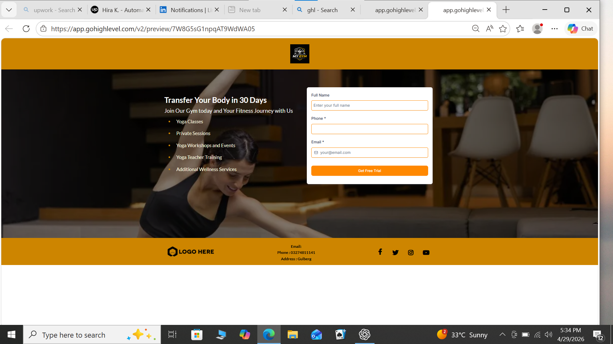
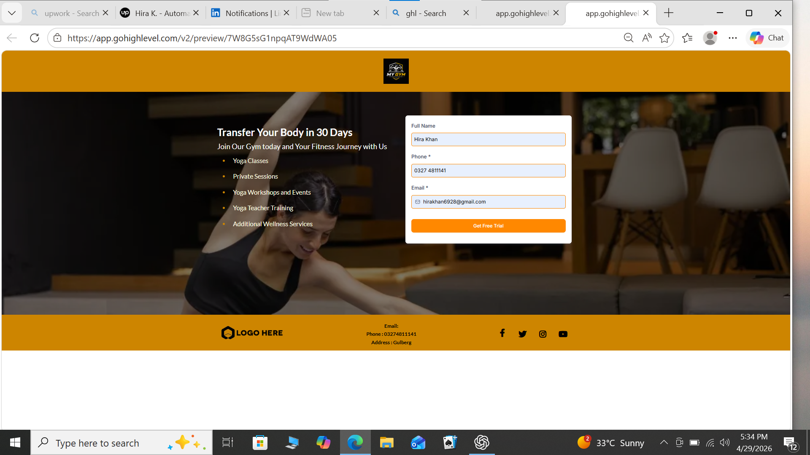
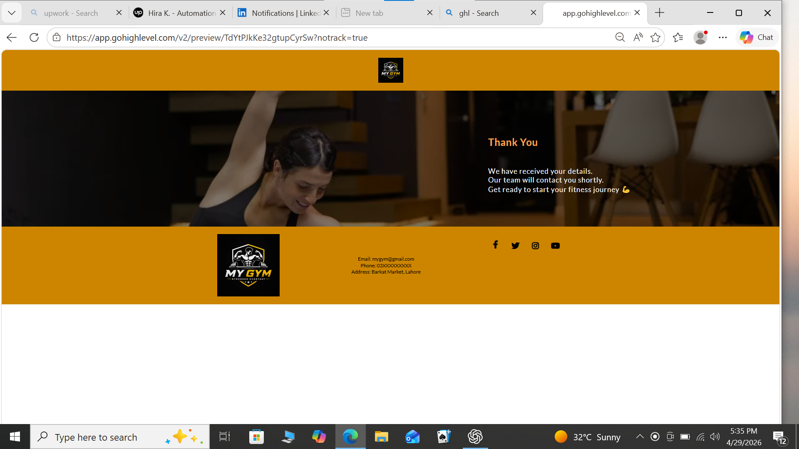

# Gym Lead Automation System (GHL)

## 📌 Overview
This project is a lead automation system built using GoHighLevel. It captures user data and automates communication through email sequences.

## ⚙️ Features
- Lead capture via funnel  
- Automated welcome email  
- Follow-up email after 1 day  
- Simple and efficient workflow  

## 🛠 Tools Used
- GoHighLevel (GHL)  
- Email Automation  

## 📸 Screenshots

## 🎯 Purpose
The goal of this project is to reduce manual work and improve lead engagement using automation

## 📸 Screenshots

